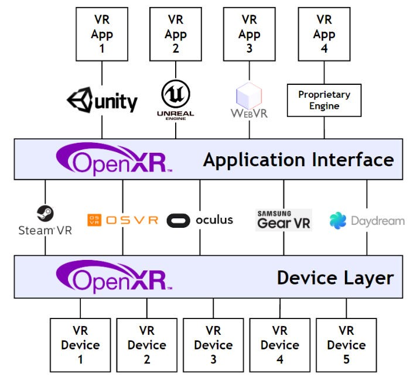

# Mixed Reality Toolkit – Multi-VR approach (High level)

## Objective

To rearchitect the current Mixed Reality Toolkit to provide:

 * An abstractable base interface that will support multiple VR platforms, predominately HL/MR/OpenVR/OpenXR
 * A Building block style front end interface that is easy for new users to construct new Mixed Reality solutions easily, whilst still providing an open framework for intensive developers to consume.

## Outline Architecture

 Figure 1 : Draft High-Level architecture 

The internal side of the MRTK, is internal / private, not something a user would need to use / access.  We can debate whether we still allow some of it to be “open” for customization.  But I feel that should be through users creating “extensions” rather than modifying base code.

The SDK side is what the users will be consuming, either through a constructed set of prefabs or adding the management scripts.  The obvious aim being to enable (as much as possible) for a consumer to drag and drop the MRTK in to their existing scene and enable behaviors / movement and interactions.

 
## High-Level Architecture breakdown

The architecture approach lends from many different sources (VRTK, OpenXR, EditorVR) to provide a structure that aligns to the aims for the Multi-VR approach proposed for the Mixed Reality Toolkit.
In all cases, the framework should follow the 80/20 rule, providing core mechanisms to deliver common use cases whilst also being open enough to allow for extension or even replacement of key components (for advanced users)

 * Device Abstraction Layer

The DAL creates a bridge layer between an external provider SDK and conforms the outputs / inputs of those devices to the MRTK construct definitions.
Ideally, these interfaces should be at the script level consuming the vendor SDK directly rather than relying on vendor prefab definitions.

 * MRTK Constructs

A coordinated set of specifications that define a generalized system for describing and interacting with multiple VR/AR platforms.  The specifications detail the inner workings for the toolkit and define extendable contracts for the SDK to expose to both providers (devices) and consumers (SDK).

 * MRTK Interface Layer

The interface layer provides an extensible bridge to map and coordinate inputs coming from VR devices and controllers as well as providing an abstracted mechanism to output to VR systems (e.g. Haptics).  It also defines preset interactions that can be composited for use by the SDK.

 * MRTK User Abstraction layer

This is the frontend of the entire SDK, providing pre-built components for the most used implementations for Mixed Reality.  This should be provided through a set of easy to use components / scripts that can be “Drag and Dropped” to build a project.
Like the Unity UI System, this does not preclude users building their own components and potentially submitting back to the project for inclusion.

 
## Key Principles

Following the feedback we’ve received both internally and through current consumers, I propose the following key principles we should follow building this new architecture:

 * The new framework needs to provide “out of the box” components to enable rapid prototyping and development.  Future internal changes should not break these components or cause them to degrade in functionality.
 * Every component / feature provided by the framework (either prefab or script) should have corresponding unit tests to validate its functionality.  Any future merge to the framework will have to validate these test before merging to ensure there is no degradation of service.
 * The new framework should provide a programmatic interface along side the SDK components, to enable advanced users to extend or replace any component within the framework.
 * Each new interface / component should be fully documented (where possible). These should detail all interactions and intended uses.  For the advanced cases, we’ll need to review how we explain how to replace components (e.g. replacing the input system with another, like InControl)
 * Working examples / demos should be created for any specific system, these should have purpose and not just be a “test”.
 * All testing components / scripts / prefabs / scenes should only be retained in the dev branch.  The master branch should only contain the “ToolKit” and working examples.  Master is for consumers only.
 * Simulator options need to be provided as another device. This will also form the template for new MR/XR/VR devices / SDKs.
 
# Open XR references

The new MRTK approach would span across the Application and SDK/Device layers, seeing how OpenXR is a Device to the new architecture.

Figure 2 : OpenXR architecture

# Expected Experience reference (starter for 10)

 * **Interaction**

- Highlighting
- Pressing (e.g. buttons and a way to execute actions like UI Buttons)
- Activation (similar to pressing but an on/off state)
- Holding
- Raw Input (exposing individual inputs in a managed way)
- Speech

 * **Manipulation**

- Grabbing
- Transforming
- Alteration (e.g. scaling, animation)

 * **Experiences**

- Controller menus / actions
- Climbing / Moving with Controllers
- Pointers and Cursors (linked to each controller input)
- Doors and Interactions

 * **Motion**

- Free Teleportation
- Restricted Teleportation
- Locomotion
- Twitch movement

 * **Extended Experiences**

- FPS
- Bow and Arrow
- Common use cases
