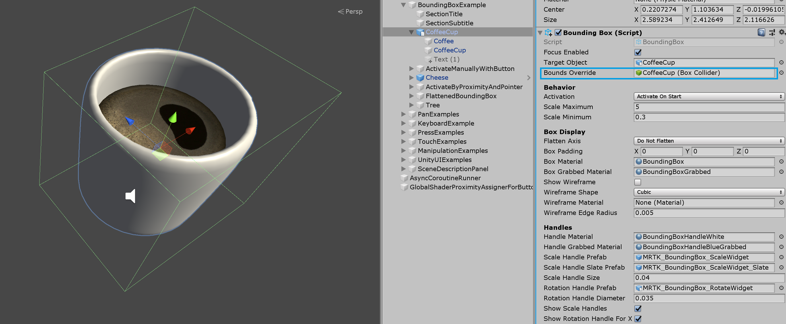
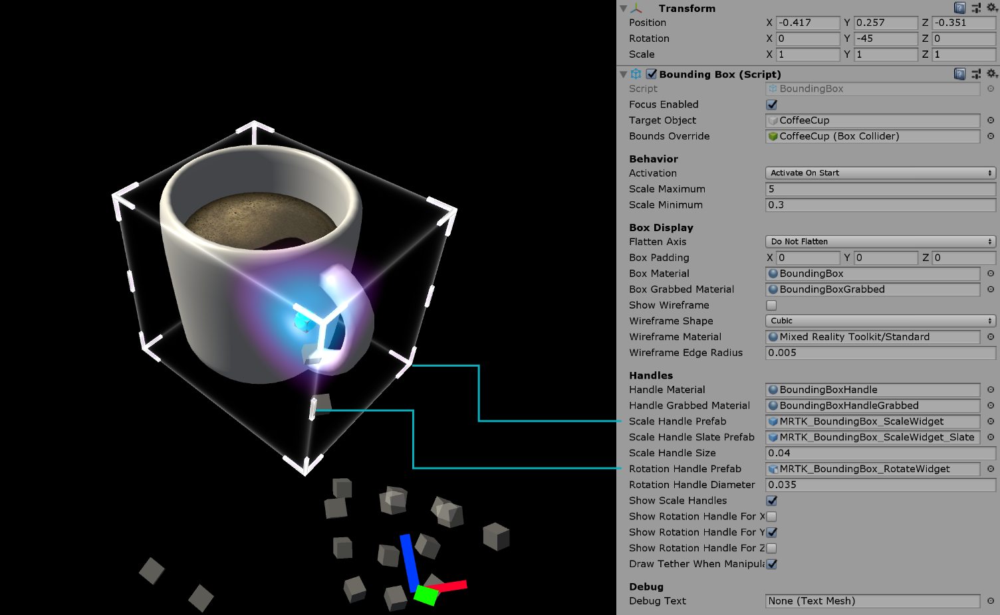

# Bounding Box #

The `BoundingBox` script provides basic functionality for transforming objects in Windows Mixed Reality. Using handles on the corners and edges, you can scale or rotate the object. On HoloLens 2, the bounding box responds to your finger's proximity. It shows visual feedback to help perceive the distance from the object. MRTK's bounding box provides various options which allow you to easily customize the interactions and visuals. 

For more information please see [App Bar and Bounding Box](https://docs.microsoft.com/en-us/windows/mixed-reality/app-bar-and-bounding-box) on Windows Dev Center.

### How to use Bounding Box ###
You can enable Bounding Box by simply assigning the `BoundingBox` script to any GameObject. Assign the object with Box Collider to 'Bounds Override' field in the Inspector.

### Example Scene ###
You can find bounding box examples in the *HandInteractionExamples.unity* scene:

### Inspector Properties ###

#### Target Object ####
This specifies which object will get transformed by the bounding box manipulation. If no object is set, the bounding box defaults to the owner object.

#### Bounds Override ####
Set a box collider from the object for bounds computation.

#### Activation Behavior #### 
There are several options to activate the bounding box interface.
 
- **Activate On Start** : Bounding Box becomes visible once the scene is started.
- **Activate By Proximity** : Bounding Box becomes visible when an articulated hand is close to the object.
- **Activate By Pointer** : Bounding Box becomes visible when it is targeted by a hand-ray pointer.
- **Activate Manually** : Bounding Box does not become visible automatically. You can manually activate it through a script by accessing the boundingBox.Active property.

#### Scale Minimum ####
The minimum allowed scale.

#### Scale Maximum ####
The maximum allowed scale.
 
#### Box Display #### 
Various bounding box visualization options.

If Flatten Axis is set to *Flatten Auto*, the script will disallow manipulation along the axis with the smallest extent. This results in a 2D bounding box, which is usually used for thin objects.
 
#### Handles #### 
You can assign the material and prefab to override the handle style. If no handles are assigned, they will be displayed in the default style.
 
#### Events #### 
Bounding Box provides the following events. The example uses these events to play audio feedback.

- **Rotate Started**
- **Rotate Ended**
- **Scale Started**
- **Scale Ended**

### Make an object movable with Manipulation Handler ###
If you want to make the object movable using far interaction, you can combine [`ManipulationHandler.cs`](README_ManipulationHandler.md) with `BoundingBox.cs`. [ManipulationHandler](README_ManipulationHandler.md) supports both one and two-handed interactions. To make [`ManipulationHandler.cs`](README_ManipulationHandler.md) work with near interaction, you should add `NearInteractionGrabbable.cs` too.

In order for the bounding box edges to be highlighted the same way when moving it using [`ManipulationHandler`](README_ManipulationHandler.md)'s far interaction, it is advised to connect its events for **On Manipulation Started** / **On Manipulation Ended** to `BoundingBox.HighlightWires` / `BoundingBox.UnhighlightWires` respectively, as shown in the screenshot above.
